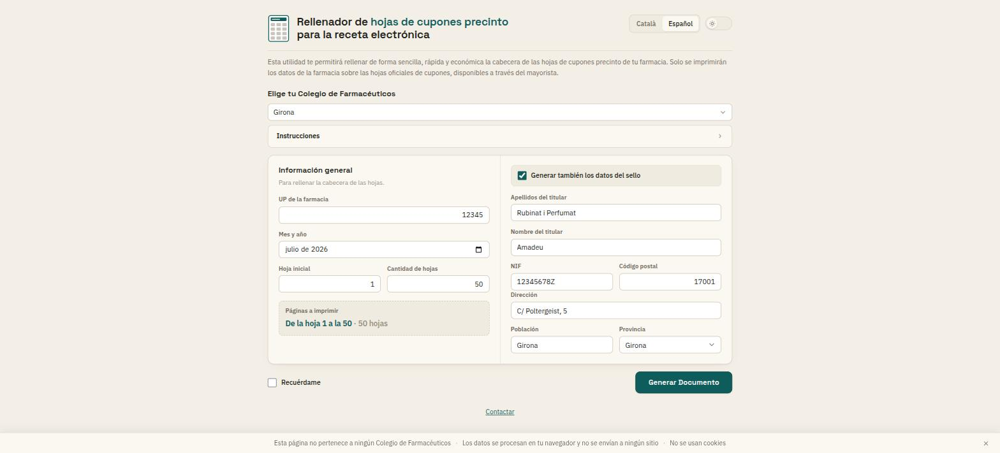

# FarmaKit

Fills in the header of Spanish pharmacy **coupon sheets** (*fulls de cupons precinte* / *hojas de cupones precinto*) for the electronic prescription system.

**→ [nuncaeslupus.github.io/farma-kit](https://nuncaeslupus.github.io/farma-kit/)**



You print the output *on top of* the official coupon sheets supplied by the wholesaler — the app prints only the pharmacy's data, never the sheet itself.

## Privacy

Everything runs in your browser. The pharmacy data you type is never uploaded: the PDF is generated locally with [pdf-lib](https://pdf-lib.js.org/). There is no backend, no analytics, and no cookies.

## Using it

1. **Pick your *col·legi de farmacèutics*.** That choice drives the rest of the form — it sets the sheet layout, the National Code, and whether the stamp section applies.
2. **Fill in the pharmacy's data.** Tick *Recuérdame* and the browser keeps it for next time.
3. **Generar Documento** → a PDF to print onto the official sheets.

Available in Catalan and Spanish. A col·legi with no template yet is listed but not selectable — the app offers to request it instead, since each sheet layout has to be traced from a real printed sheet.

## Development

```bash
npm install
npm run dev        # dev server → localhost:5173/farma-kit/
npm test           # Vitest, once
npm run build      # typecheck + production build → dist/
```

Vite + Lit + TypeScript, no backend. Pushes to `main` deploy automatically via GitHub Actions.

Maintainer documentation — architecture, how to add a col·legi, the template editor, gotchas and current status — lives in **[`status/handoff.md`](status/handoff.md)**.

## License

MIT — see [LICENSE](LICENSE).
